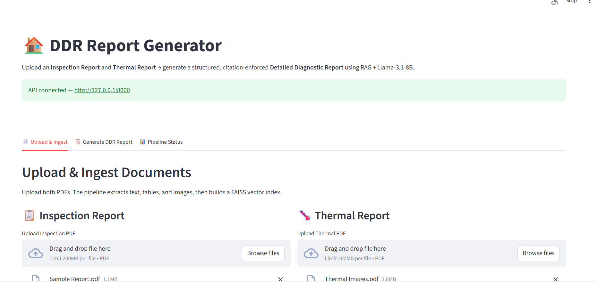
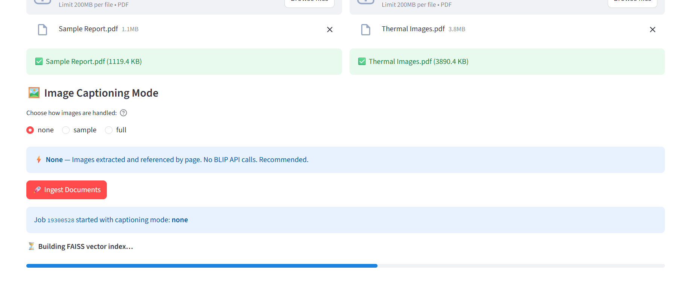
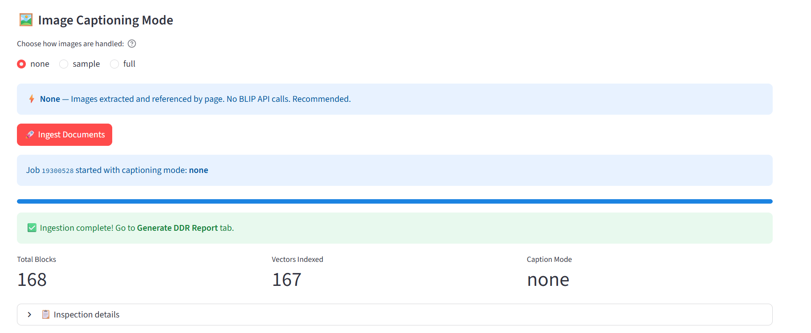
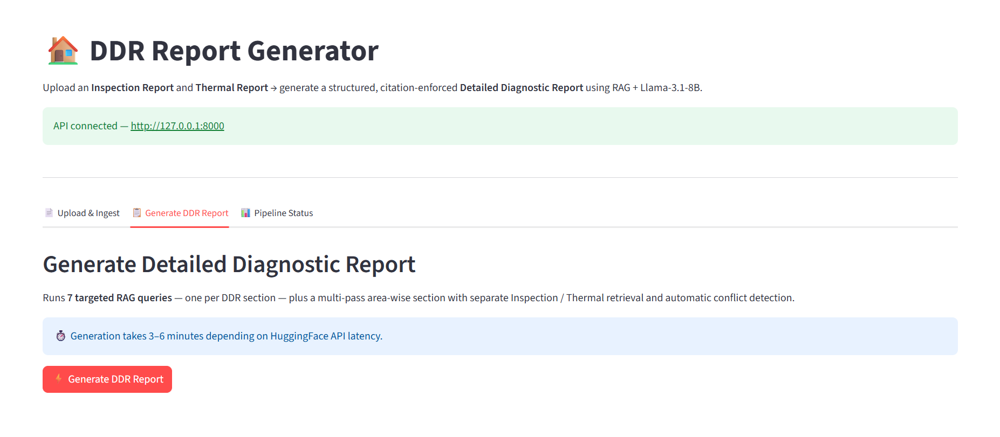
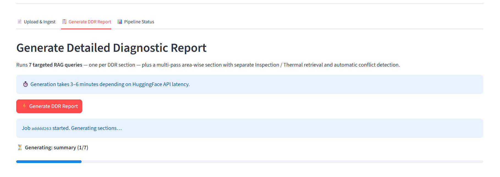
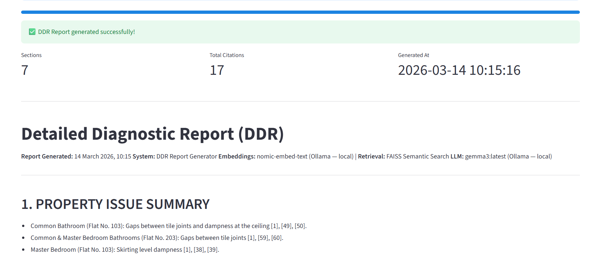

# DDR Report Generator

### AI-Powered Detailed Diagnostic Report Generation — Fully Local RAG Pipeline

> Automatically generates a structured, citation-enforced **Detailed Diagnostic Report (DDR)** from Inspection and Thermal PDFs using a fully local AI stack (no cloud API required for core pipeline).

---

## 📸 Screenshots

### Upload & Ingest — Step 1


### Upload & Ingest — Step 2


### Upload & Ingest — Step 3 (Vectors Indexed)


### Generate DDR — Running


### Generate DDR — Complete


### Final Report Output


---

## 📄 Sample Output

**[View Sample DDR Report →](DDR_report.md)**

The generated report includes:
- 9 property-wide thermal readings cited from the thermal PDF
- 6 area-wise observation sections (Hall, Bedroom, Kitchen, Master Bedroom, Parking, Common Bathroom)
- 11 root causes with page-level citations
- 3-tier recommended actions (Immediate / Short-term / Long-term)
- Rotating supporting thermal images per area

---

## What It Does

Drop in an **Inspection PDF** and a **Thermal PDF** — the system will:

1. **Extract** text, tables, and images from both PDFs (PyMuPDF + pdfplumber)
2. **Filter** logos and headers automatically using pixel-level analysis
3. **Embed** all content using `nomic-embed-text` via local Ollama
4. **Index** 160+ vectors into a FAISS cosine similarity store
5. **Retrieve** targeted chunks per DDR section with source + type filters
6. **Generate** a 7-section DDR via `gemma3:latest` with `[N]` citation enforcement
7. **Serve** results via FastAPI REST API + Streamlit 3-tab UI

---

## Architecture

```
┌─────────────────────────────────────────────────────────────────────┐
│                     Streamlit UI (3 tabs)                            │
│          Upload & Ingest  |  Generate DDR  |  Report Output          │
└──────────────────────────┬──────────────────────────────────────────┘
                           │ HTTP (polling /job/{id} every 3s)
┌──────────────────────────▼──────────────────────────────────────────┐
│                       FastAPI REST API                               │
│       /ingest  /generate-ddr  /job/{id}  /report  /status  /reset   │
│             Background threads — returns job_id in <1s              │
└──────────────────────────┬──────────────────────────────────────────┘
                           │
┌──────────────────────────▼──────────────────────────────────────────┐
│                      DDRPipeline (Orchestrator)                      │
│                                                                      │
│  ┌─────────────┐                      ┌──────────────────────────┐  │
│  │  PDFParser  │                      │      DDRGenerator        │  │
│  │  PyMuPDF    │──► FAISSStore ───────►  7-section RAG pipeline  │  │
│  │  pdfplumber │   nomic-embed-text   │  text+table only context │  │
│  │  Pillow     │   IndexFlatIP        │  image rotation per area │  │
│  │  logo filter│   cosine similarity  │  thermal summary (once)  │  │
│  └─────────────┘                      └──────────┬───────────────┘  │
│                                                  │                  │
│                                       ┌──────────▼───────────────┐  │
│                                       │     AnswerGenerator       │  │
│                                       │   gemma3:latest (Ollama)  │  │
│                                       │   Citation-enforced [N]   │  │
│                                       │   temp=0.1, max_tok=700   │  │
│                                       └──────────────────────────┘  │
└─────────────────────────────────────────────────────────────────────┘
```

---

## DDR Report — 7 Sections

| # | Section | What It Contains |
|---|---------|-----------------|
| 1 | **Property Issue Summary** | 4–6 key issues with citations |
| 2 | **Area-Wise Observations** | Thermal survey (property-wide) + per-area inspection findings + rotating images |
| 3 | **Probable Root Cause** | Likely causes tied to specific observations |
| 4 | **Severity Assessment** | Low / Moderate / High with cited evidence |
| 5 | **Recommended Actions** | Immediate / Short-term / Long-term action plan |
| 6 | **Additional Notes** | Observations not covered elsewhere |
| 7 | **Missing / Unclear Info** | Gaps, unanswered checklist items |

---

## Tech Stack

| Component | Technology | Notes |
|-----------|-----------|-------|
| PDF Text Extraction | PyMuPDF (fitz) | Text + embedded images |
| Table Extraction | pdfplumber | Structured table chunks |
| Logo Filtering | Pillow (PIL) | Pixel-level dark/light background detection |
| Image Captioning | Salesforce BLIP (HF API) | Optional — `none / sample / full` modes |
| Embeddings | `nomic-embed-text` via Ollama | Fully local, no rate limits |
| Vector Store | FAISS `IndexFlatIP` | Cosine similarity on L2-normalised vectors |
| LLM | `gemma3:latest` via Ollama | Fully local generation |
| REST API | FastAPI | Background jobs + polling |
| UI | Streamlit | 3-tab interface |
| Testing | pytest | API test suite |

---

## Project Structure

```
DDR_Report_Generator/
├── config.py                        # All config + env variables
├── app/
│   └── api.py                       # FastAPI — background threads + job polling
├── captioner/
│   └── image_captioner.py           # Optional BLIP captioning (HF API)
├── generator/
│   ├── answer_generator.py          # Citation-enforced LLM generation
│   └── ddr_generator.py             # 7-section DDR orchestration
├── parser/
│   └── pdf_parser.py                # Text + table + image extraction with logo filter
├── pipeline/
│   └── ddr_pipeline.py              # End-to-end pipeline orchestrator
├── retriever/
│   └── retriever.py                 # Source-aware + type-aware retrieval
├── storage/
│   └── faiss_store.py               # FAISS IndexFlatIP + metadata sidecar
├── ui/
│   └── streamlit_app.py             # Streamlit — 3-tab UI
├── assets/                          # Screenshots for README
├── data/                            # Place your PDFs here
├── extracted_images/                # Images extracted from PDFs (auto-created)
├── output/                          # Generated reports (auto-created)
├── vector_store/                    # FAISS index files (auto-created)
├── DDR_report.md                    # Latest generated report
├── LICENSE
├── .gitignore
└── requirements.txt
```

---

## Prerequisites

Install [Ollama](https://ollama.com) and pull the required models:

```bash
ollama pull nomic-embed-text
ollama pull gemma3
```

---

## How to Run

### 1. Clone and install

```bash
git clone https://github.com/your-username/DDR_Report_Generator.git
cd DDR_Report_Generator
pip install -r requirements.txt
```

### 2. Configure environment

```bash
cp .env.example .env
# HF_TOKEN only needed if using BLIP image captions (caption_mode = sample or full)
```

### 3. Start Ollama

```bash
ollama serve   # if not already running
```

### 4. Start the API

```bash
uvicorn app.api:app --reload
# → http://127.0.0.1:8000
# → Swagger docs: http://127.0.0.1:8000/docs
```

### 5. Start the UI

```bash
# New terminal
streamlit run ui/streamlit_app.py
# → http://localhost:8501
```

### 6. Use the app

1. **Upload tab** — Upload Inspection PDF + Thermal PDF → click Ingest
2. **Generate tab** — Select caption mode → click Generate DDR
3. **Report tab** — View and download the generated DDR

> **Note:** After the first ingest, the FAISS index is saved to disk. On subsequent restarts you can go straight to Generate — no re-ingest needed unless PDFs change.

---

## API Endpoints

| Method | Endpoint | Description |
|--------|----------|-------------|
| GET | `/health` | Health check |
| POST | `/ingest` | Upload PDFs → parse → embed → index |
| POST | `/generate-ddr` | Start DDR generation (returns `job_id`) |
| GET | `/job/{job_id}` | Poll generation progress |
| GET | `/report` | Download last DDR as Markdown |
| GET | `/status` | Vector store stats + pipeline readiness |
| DELETE | `/reset` | Clear all indexes |

---

## Key Design Decisions

### Text-Only LLM Context
All 7 section retrievals use **text and table chunks only** — never image chunks. Image chunks contain only filenames (e.g. `thermal_images_p3_i77.jpeg`) which cause LLMs to hallucinate. Images are used purely as visual attachments, never as generation context.

### Thermal Survey — Honest Presentation
The thermal PDF stores temperature readings as plain text with no room labels. Rather than assigning the same readings to every area (misleading), the system generates **one property-wide thermal summary** at the top of Section 2 with a clear note explaining the limitation.

### Image Rotation Per Area
All extracted images are pooled and distributed across areas using a cursor — ensuring each area gets visually distinct supporting images rather than the same two images repeated everywhere.

### Logo Filtering
The PDF parser uses Pillow to analyse pixel distributions before saving an image. Images where >40% of pixels are near-black or >55% are near-white are classified as logos/headers and skipped.

### Large-K FAISS Filtering
When filtering by source or type after retrieval, FAISS searches `min(total_vectors, top_k × 15)` results before applying filters. This prevents the common failure where all top-k results are image chunks and the filter returns nothing.

---

## Known Limitations

| Limitation | Reason | Workaround |
|-----------|--------|-----------|
| Thermal readings not room-specific | Thermal PDF has no room labels in text | Enable BLIP captions (`sample` mode) for image-based room identification |
| Area findings sometimes generic | Inspection PDF text doesn't always tag findings by room | Semantic retrieval best-effort |
| No OCR for scanned PDFs | PyMuPDF extracts embedded text only | Add Tesseract OCR as pre-processing step |

---

## Environment Variables

| Variable | Description | Required |
|----------|-------------|----------|
| `HF_TOKEN` | HuggingFace API token | Only for BLIP captions |

---

## License

MIT
